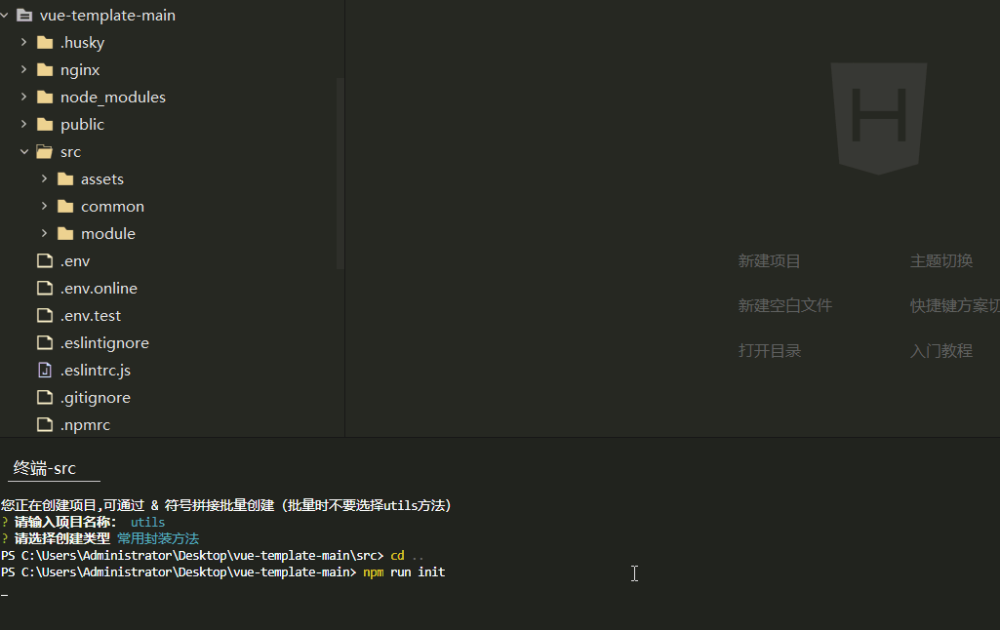

# EasyTemplate
根据一个大佬的脚本魔改来的快捷创建模板脚本，增加批量创建

## 预览



## 使用说明

1. 将项目克隆或下载下来

2. 将 initTemplate 文件夹放入自己项目src下的任意文件夹下

3. 推荐放入src/common 文件夹

4. 安装终端询问插件

   ```
   npm install inquirer
   or
   yarn add inquirer
   ```

5. 为脚本添加执行入口  路径应与克隆下来的文件存放路径相同

   ```
   在package.json 追加命令
   
   "init": "node ./src/common/initTemplate/index.js",
   ```

6. 到此就可以愉快的使用了

## 使用

在终端 键入命令 npm run lint

会提示输入相应 的项目名 可以通过 & 进行分割 批量创建模板

回车后可以选择自己想要的模板

选择后回车即可

tip: 批量时 不要选择utils常用方法模板 这个创建一份就够了

## 脚本目录结构

```
initTemplate 
 ├─template
 │  ├─init         // 初始项目模板
 │  │  ├─style
 │  │  └─view
 │  ├─reactView    // react页面模板
 │  ├─routerView  // vue路由页面模板
 │  ├─routerViewTS  // vue路由页面TS模板
 │   └─utilFunction  // //常用工具方法
 └─ index.js  // 脚本
```

模板内容可以随意自定义，脚本也很简单可以直接添加脚本然后在脚本文件内修改即可


## 注

tip： 自己自定义模板时注意 

1. 如果需要将模板创在 src 目录下 脚本内模板取名字时 不能加上 **路由** 二字
2. 如果需要创建在 view 下 模板取名字时 一定要加上 **路由** 二字 
3. 应为脚本内根据这两个字 判断要创建的位置
4. 当然大牛直接 修改脚本逻辑也是没问题的


现在前期准备感觉挺麻烦的，后续研究研究改成 npm 版本，告辞！！


## NPM版本来了

基本使用差不多，话不多说 开始吧

安装

```js
npm install clone-tpl
or
yarn add clone-tpl
```

配置

```js
// 在package.json 下添命令

"init": "node ./node_modules/clone-tpl/index.js"
```


然后就可以愉快的使用了（使用方法与前面相同 npm run init 即可）


### npm模板修改 说明

由于经过npm包装， 修改的话需要在 node_modules下找到对应的位置

可以在文件夹直接搜索 clone-tpl 内容与非npm版基本一致

1.  修改模板的话只能直接 在node_modules  内 修改， 多人开发同步会有问题（不过一个人建立好模板内容一般也就足够了）


注意： 使用npm 版需保证  有与node_modules 同级的src文件夹，不然会找不到对应的 位置（也可自行修改脚本）

脚本贴出来吧，不到200行，本人小白写的挺渣（放最后了，以免影响阅读）

```js
#!/usr/bin/env node

console.log('您正在创建项目,可通过 & 符号拼接批量创建（批量时不要选择utils方法）')
const path = require('path')
const fs = require('fs')
const inquirer = require('inquirer')
const stat = fs.stat

// 配置项
const config = {
	// 初始化模板项目 主要用于多入口项目时
	initAddress: '../../', // 目标初始化路径 src
	routerAddress: '../../view', // 目标路由组件路径 src/view
	targetInit: './template/init/', // 初始化模板路径
	targetRouter: './template/routerView/', // 路由模板路径
	targetRouterTS: './template/routerViewTS/', // 路由TS模板路径
	targetReact: './template/reactView/', // reactPage模板路径
	targetUtils: './template/utilFunction/' // 常用工具方法
}

// 模板路径
const targetDirInit = path.resolve(__dirname, config.targetInit)
const targetDirRouter = path.resolve(__dirname, config.targetRouter)
const targetDirRouterTS = path.resolve(__dirname, config.targetRouterTS)
const targetDirReact = path.resolve(__dirname, config.targetReact)
const targetDirUtils = path.resolve(__dirname, config.targetUtils)

// 询问用户配置项
const question = [
	{
		type: 'input',
		name: 'name',
		message: '请输入项目名称：'
	},
	{
		type: 'list', // 交互类型 -- 单选（无序）
		message: '请选择创建类型', // 引导词
		name: 'template', // 自定义的字段名
		choices: ['路由模板', '路由模板-TS版', '初始模板', 'reactPage模板', '常用封装方法'] // 选项列表
	}
]

// 拷贝文件方法
const copyFile = (targetDir, resultDir) => {
	// 读取文件、目录
	fs.readdir(targetDir, function (err, paths) {
		if (err) {
			throw err
		}
		paths.forEach(function (p) {
			const target = path.join(targetDir, '/', p)
			const res = path.join(resultDir, '/', p)
			let read
			let write
			stat(target, function (err, statsDta) {
				if (err) {
					throw err
				}
				if (statsDta.isFile()) {
					read = fs.createReadStream(target)
					write = fs.createWriteStream(res)
					read.pipe(write)
				} else if (statsDta.isDirectory()) {
					fs.mkdir(res, function () {
						copyFile(target, res)
					})
				}
			})
		})
	})
}

// 根据选择的模板进行不同的 操作
const templateSelect = (template, resultDir) => {
	// 判断使用那个模板
	switch (template) {
		case '初始模板':
			copyFile(targetDirInit, resultDir)
			break
		case '路由模板':
			copyFile(targetDirRouter, resultDir)
			break
		case '路由模板-TS版':
			copyFile(targetDirRouterTS, resultDir)
			break
		case 'reactPage模板':
			copyFile(targetDirReact, resultDir)
			break
		case '常用封装方法':
			copyFile(targetDirUtils, resultDir)
			break
	}
}

// 批量创建名称 处理
const division = name => {
	name = name.trim()
	if (!name) {
		console.log('项目目录不能为空')
		// 如果输入空，继续询问
		createProject()
		return false
	} else {
		let temp = name.split('&')
		return [...new Set(temp)]
	}
}

// 主程序
const createProject = () => {
	// 询问用户问题
	inquirer
		.prompt(question)
		.then(({ name, template }) => {
			let nameArr = division(name)
			if (!nameArr) return false

			// 当选择的未路由组件时 检查view目录是否存在 不存在则先创建
			if (template.includes('路由')) {
				let pathDir = path.resolve(__dirname, config.routerAddress)
				fs.access(pathDir, function (err) {
					if (err) {
						fs.mkdir(pathDir, function (err) {
							if (err) throw err
						})
					}
				})
			}

			// 批量创建
			nameArr.forEach(item => {
				if (item.trim()) {
					// 目标路径
					const resultDir = !template.includes('路由')
						? path.resolve(__dirname, config.initAddress, item)
						: path.resolve(__dirname, config.routerAddress, item)

					// fs.access()方法用于测试文件是否存在
					fs.access(resultDir, function (err) {
						if (err) {
							fs.mkdir(resultDir, function (err) {
								if (err) throw err
								// 判断使用那个模板
								templateSelect(template, resultDir)
							})
						} else {
							console.log(`${item} 模板目录已存在，请输入其他名称`)
							// 不存在，继续询问
							createProject()
						}
					})
				}
			})
		})
		.catch(err => {
			console.log(err)
		})
}

createProject()

```

